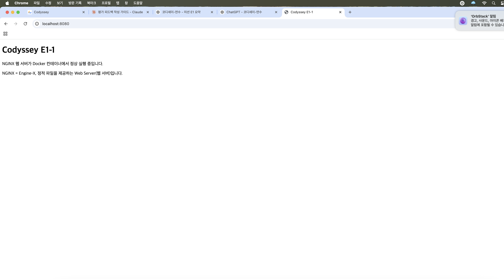
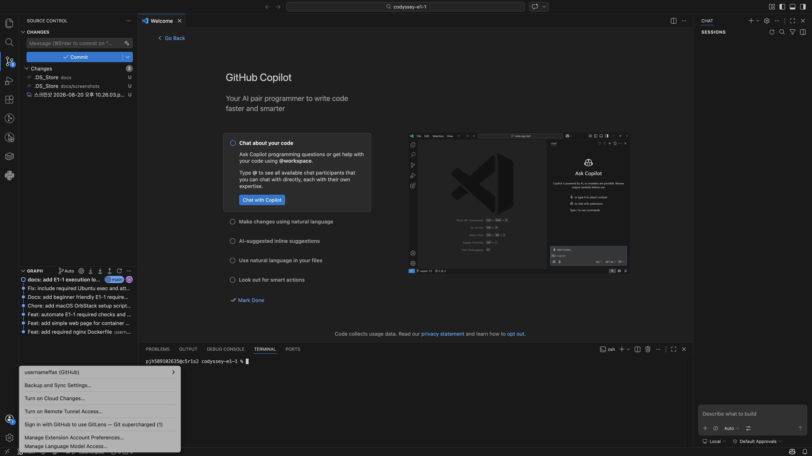

# E1-1 내 컴퓨터에 개발자용 작업실 꾸미기

이 저장소는 **필수 과제만** 수행합니다. Bonus(보너스)는 포함하지 않습니다.

## 1. 목표

- CLI(Command Line Interface, 명령줄 인터페이스): 터미널 명령 사용
- Docker: 컨테이너(Container, 격리 실행 환경) 실행
- Dockerfile: Docker Image(이미지)를 만드는 설명서 작성
- Port Mapping(포트 매핑): Mac의 포트와 컨테이너의 포트 연결
- Bind Mount(바인드 마운트): Mac 폴더를 컨테이너 폴더에 직접 연결
- Volume(볼륨): 컨테이너를 삭제해도 데이터 유지
- Git/GitHub: 로컬 버전 관리와 원격 저장소 연결

## 2. 실행 환경

- Host OS(호스트 운영체제): macOS
- Container Engine(컨테이너 엔진): OrbStack
- Linux Container: Ubuntu 24.04
- Shell(쉘): zsh 또는 bash

실제 버전은 자동 스크립트가 `docs/logs/01-environment.log`에 기록합니다.

## 3. 가장 빠른 실행 순서

저장소를 Mac에 clone(복제)한 뒤 실행합니다.

```bash
git clone https://github.com/usernameffas/codyssey-e1-1.git
cd codyssey-e1-1
chmod +x scripts/*.sh
./scripts/setup_mac.sh
./scripts/run_required.sh
```

`setup_mac.sh`는 필요한 최소 환경을 확인하고 OrbStack을 실행합니다.
`run_required.sh`는 미션 필수 실습을 순서대로 실행하고 로그를 `docs/logs/`에 저장합니다.

## 4. 수행 체크리스트

- [x] 터미널 기본 조작
- [x] 파일/디렉터리 권한 변경
- [x] Docker 버전 및 Engine 동작 확인
- [x] `hello-world` 실행
- [x] Ubuntu 24.04 컨테이너 실행
- [x] Docker 이미지/컨테이너/로그/리소스 확인
- [x] Dockerfile 기반 웹 서버 이미지 빌드
- [x] Port Mapping(포트 매핑) 접속 확인
- [x] Bind Mount(바인드 마운트) 변경 반영 확인
- [x] Named Volume(이름 있는 볼륨) 영속성 확인
- [x] Git 설정/원격 저장소 상태 기록
- [x] 브라우저 주소창이 보이는 접속 화면 캡처
- [x] VSCode GitHub 로그인/연동 화면 캡처

마지막 두 항목은 GUI(Graphical User Interface, 화면 인터페이스) 증거라 자동화할 수 없으므로 직접 캡처합니다.

## 5. 자동 생성 로그

| 파일 | 확인 내용 |
|---|---|
| `docs/logs/01-environment.log` | macOS, Shell, Git, Docker 정보 |
| `docs/logs/02-terminal.log` | pwd, ls, mkdir, touch, cp, mv, rm 등 |
| `docs/logs/03-permissions.log` | Ubuntu 24.04에서 파일/폴더 권한 변경 전후 |
| `docs/logs/04-docker-basic.log` | hello-world, image, container 목록 |
| `docs/logs/05-web-and-port.log` | Docker build/run, curl, logs, stats |
| `docs/logs/06-bind-mount.log` | Host 파일 변경이 컨테이너에 반영되는지 확인 |
| `docs/logs/07-volume.log` | 컨테이너 삭제 뒤에도 데이터가 남는지 확인 |
| `docs/logs/08-git.log` | Git 설정, remote, status |

## 6. 핵심 용어 쉽게 설명

### CLI
CLI = Command Line Interface. 마우스 대신 글자로 명령하는 방식입니다.

### Image와 Container
- Image(이미지): 실행 환경의 설계도/원본
- Container(컨테이너): 이미지를 실제로 실행한 인스턴스

### Port Mapping

```text
Mac localhost:8080  --->  Container:80
```

명령 예:

```bash
docker run -d --name e1-web -p 8080:80 codyssey-e1-1-web:1.0
```

`-p 8080:80`에서 앞은 Mac 포트, 뒤는 컨테이너 포트입니다.

### Bind Mount
Mac의 실제 폴더를 컨테이너에 연결합니다. Mac 파일을 바꾸면 컨테이너에서도 바로 바뀝니다.

```bash
docker run -d -p 8081:80 \
  -v "$PWD/site:/usr/share/nginx/html:ro" \
  nginx:alpine
```

### Volume
Docker가 관리하는 저장 공간입니다. 컨테이너를 삭제해도 Volume을 삭제하지 않으면 데이터가 남습니다.

## 7. Dockerfile 설명

```dockerfile
FROM nginx:alpine
COPY site/ /usr/share/nginx/html/
EXPOSE 80
```

- `FROM`: 어떤 Base Image(기본 이미지)를 사용할지 지정
- `COPY`: 내 파일을 이미지 안으로 복사
- `EXPOSE`: 웹 서버가 사용하는 포트가 80임을 문서화

## 8. 직접 다시 검증하는 명령

```bash
docker build -t codyssey-e1-1-web:1.0 .
docker run -d --name e1-web -p 8080:80 codyssey-e1-1-web:1.0
curl http://localhost:8080
docker logs e1-web
docker stats --no-stream e1-web
docker rm -f e1-web
```

## 9. 권한(permission) 설명

Linux 권한은 `r`, `w`, `x`로 표현합니다.

- r = read(읽기) = 4
- w = write(쓰기) = 2
- x = execute(실행) = 1

예:

- `644` = owner(소유자) `rw-`, group `r--`, others `r--`
- `755` = owner `rwx`, group `r-x`, others `r-x`

이 저장소에서는 Ubuntu 24.04 컨테이너 안에서 파일과 디렉터리 권한을 실제 변경합니다.

## 10. Git과 GitHub 차이

- Git: 내 컴퓨터에서 변경 이력을 관리하는 Version Control System(VCS, 버전 관리 시스템)
- GitHub: Git 저장소를 인터넷에서 보관하고 공유하는 원격 플랫폼

확인:

```bash
git config --list
git remote -v
git status
```

## 11. 트러블슈팅

### 문제 1: `Cannot connect to the Docker daemon`

- 의미: Docker CLI는 있지만 Engine(엔진)에 연결되지 않음
- 확인: `docker info`
- 해결: OrbStack 앱 실행 후 다시 `docker info`

### 문제 2: `port is already allocated` 또는 `address already in use`

- 의미: 8080 포트를 다른 프로그램이 이미 사용 중
- 확인:

```bash
lsof -i :8080
```

- 해결: 기존 컨테이너를 종료하거나 다른 포트 사용

```bash
docker rm -f e1-web
# 또는
# -p 8082:80 처럼 Host 포트를 변경
```

## 12. 제출 전 수동 캡처 2개

자동 스크립트가 끝난 뒤 아래만 직접 합니다.

1. 웹 서버를 다시 실행하고 브라우저 주소창과 화면을 함께 캡처

```bash
docker build -t codyssey-e1-1-web:1.0 .
docker run -d --name e1-web -p 8080:80 codyssey-e1-1-web:1.0
```

브라우저: `http://localhost:8080`

2. VSCode에서 GitHub 계정 로그인 + 이 저장소가 열린 화면 캡처

캡처에는 Token(토큰), Password(비밀번호), Private Key(개인키)를 노출하지 않습니다.


## 13. 실행 증거

### Port Mapping(포트 매핑) 브라우저 접속

아래 화면은 Docker 컨테이너의 80번 포트를 Mac의 8080번 포트에 연결한 뒤,
`http://localhost:8080`으로 정상 접속한 증거입니다.



### VSCode + GitHub 연동

아래 화면은 VSCode에서 이 저장소를 열고 GitHub 계정으로 로그인한 상태를 보여줍니다.


